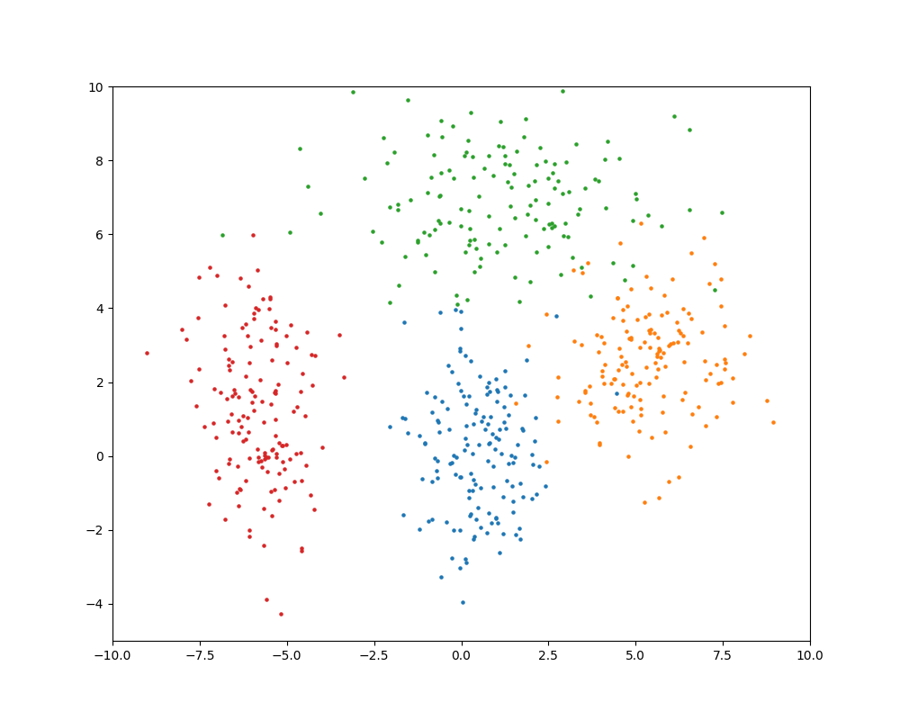

# Gaussian Mixture Model (Expectation Maximization)
Implement EM-algorithm for Gaussian Mixture Model in pytorch.

### Usage

```sh
python run_gmm.py --k 4 --epoch 30 --model_class GMM
```

### Origin data distribution



### K clustering result (Find K Gaussian distribution)


